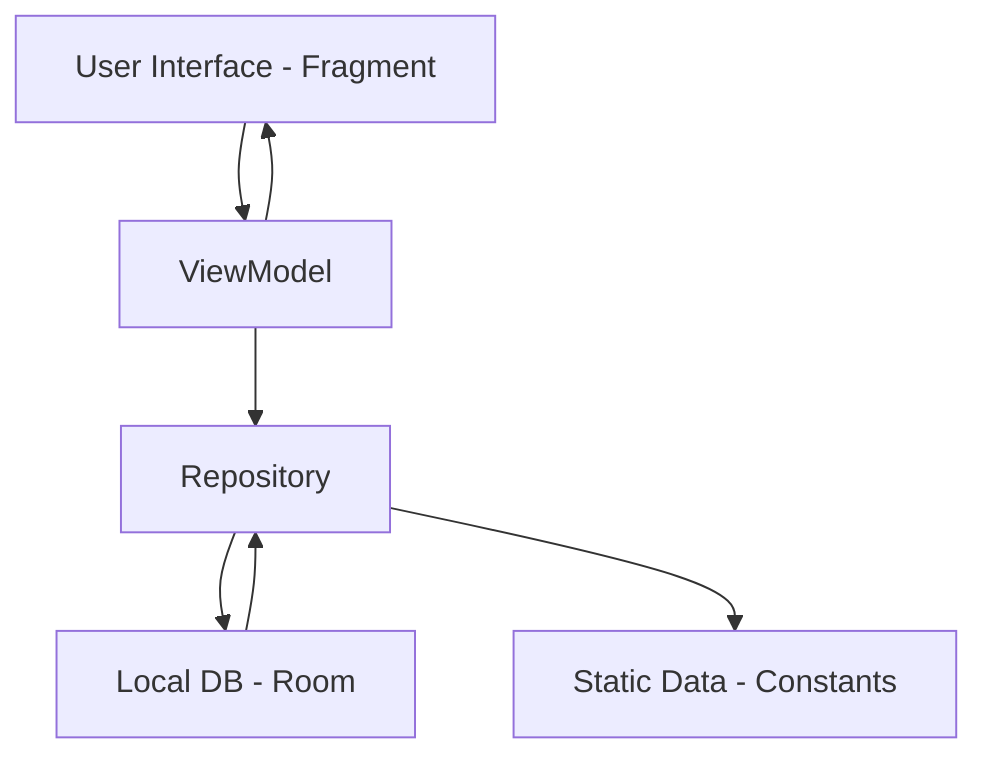

<div align="center">

# DailyCart

### A Modern Grocery Delivery Android App built with Kotlin

**DailyCart is a professional e-commerce application designed for rapid grocery delivery, featuring real-time search, category-based filtering, and a robust order tracking system—built using modern Android development practices.**

Focused on clean architecture, local data persistence, and scalable UI patterns, this project demonstrates practical Android app development for B.Tech academic and professional portfolios.

[Features](#key-features) • [Architecture](#architecture--flow) • [Tech Stack](#tech-stack--architecture) • [Getting Started](#getting-started)

</div>

---

## Project Overview

Many e-commerce applications are cluttered or fail to maintain data integrity when product details change over time.

**DailyCart** was built to provide:

* **Fast Navigation:** A clean, high-performance UI matching a modern brand identity.
* **Data Snapshotting:** Order history that preserves exact prices and addresses at the time of purchase using JSON serialization.
* **Intelligent Search:** Real-time product filtering with empty-state handling.
* **Scalable Foundation:** Built as a precursor to large-scale systems like the Farmer AI/Smart Kisan project.

This project emphasizes clean architecture, resource optimization, and maintainable code.

---

## Architecture & Flow



### Architectural Highlights

* **MVVM Architecture** for strict separation of concerns.
* **ViewModel + LiveData** for reactive and lifecycle-aware UI updates.
* **Repository Pattern** serving as the single source of truth for the app's data.
* **Single Activity Multiple Fragments** approach using Jetpack Navigation.

---

## Key Features

### Real-time Search
Optimized search bar that filters the master product list instantly. Includes custom "No Results Found" logic with dedicated empty-state handling.

### Category Filtering
Thematic browsing for Vegetables, Fruits, Dairy, Snacks, Beverages, and Ice Cream. Selecting a category dynamically updates the product grid.

### Address Management
Full CRUD support for delivery addresses. Features auto-selection of default addresses and snapshotting during checkout to prevent history loss.

### Order Snapshotting
Orders are saved with a JSON snapshot of items. This ensures that even if a product price changes later, your history remains accurate.

### Custom Branding
Polished Splash Screen featuring a branded logo and smooth fade-in animations synchronized with a Green-Orange color palette.

### Cart & Checkout
Seamless flow from product selection to a detailed bill summary and mock payment processing.

### Clean & Modern UI
* **Material3 Components:** CardViews, Buttons, and Toolbars following the latest design specifications.
* **Responsive Layouts:** Optimized for various screen sizes, ensuring clarity even on entry-level devices.

---

## Tech Stack & Architecture

### Core Technologies

* **Language:** Kotlin  
* **Architecture:** MVVM (Model–View–ViewModel)  
* **Local Database:** Room Persistence Library  
* **Serialization:** Gson (for JSON snapshots in SQLite)  

### Android Jetpack

* **ViewModel** – State management through configuration changes.  
* **LiveData** – Reactive data streams to the UI.  
* **Navigation Component** – Safe and structured fragment transitions.  
* **View Binding** – Type-safe UI component interaction.  

### Graphics & Animations

* **Custom Splash API** – Professional app entry point.  
* **XML Animations** – Smooth alpha and scale transitions.  

---

## Getting Started

### Clone the Repository

```bash
git clone https://github.com/iRahmanG/DailyCart.git
```

### Open in Android Studio

* Open Android Studio  
* Select **Open an Existing Project**  
* Choose the `DailyCart` folder  

### Build & Run

* Build project to generate ViewBinding classes.  
* Run on an emulator (minimum API 24).  

---

## Learning Outcomes

This project demonstrates:

* Implementation of a professional **MVVM pattern**.  
* Handling relational data in Room using JSON string converters.  
* Creating a consistent brand identity across XML themes and layouts.  
* Managing complex UI states (Loading, Empty, Data) reactively.  

---

<div align="center">

## Author

**Maksud Rahman**  

GitHub: [https://github.com/iRahmanG](https://github.com/iRahmanG)

If this project helped you understand scalable Android architecture, consider starring the repository.

</div>
